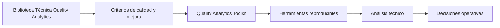
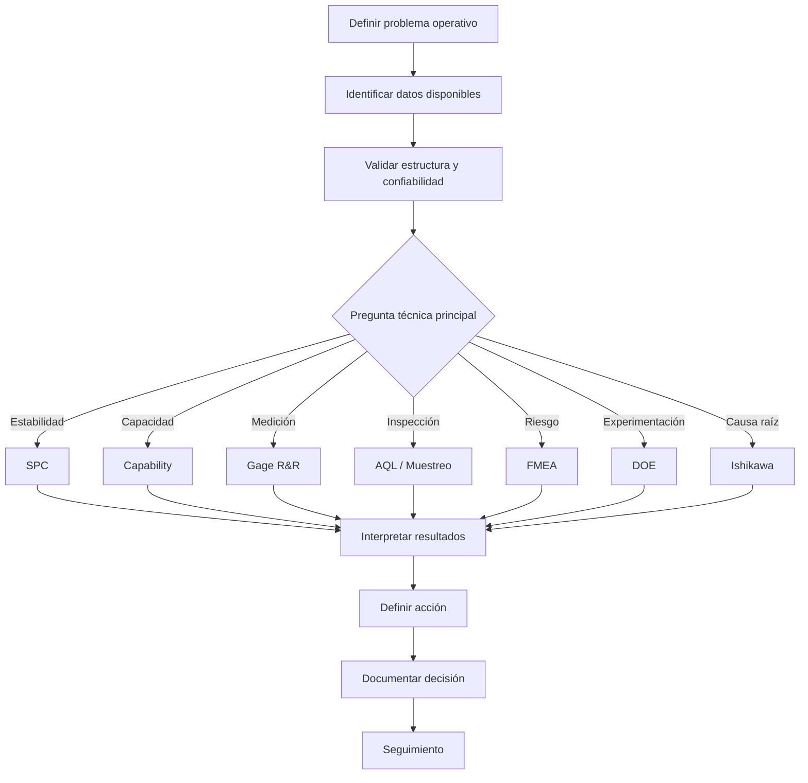

# Quality Analytics Toolkit

Herramientas prácticas para convertir métodos de calidad, estadística aplicada y mejora continua en análisis más claros y decisiones operativas mejor sustentadas.

Este repositorio es la extensión técnica de la **Biblioteca Técnica Quality Analytics** para métodos como SPC, capacidad de proceso, MSA, Gage R&R, AQL, DOE, FMEA y causa raíz.

El foco no es usar herramientas estadísticas por separado. El foco es reducir la distancia entre datos operativos, método técnico, interpretación y acción.

---

## Rol dentro del ecosistema

La biblioteca organiza el criterio. Este toolkit convierte parte de ese criterio en aplicaciones, scripts, notebooks y flujos de análisis.

---

## Qué problemas atiende

| Si necesitas... | Herramienta relacionada | Decisión que ayuda a mejorar |
|---|---|---|
| Saber si un proceso es estable | SPC | Cuándo reaccionar y cuándo no sobreajustar |
| Evaluar si un proceso cumple especificaciones | Capacidad de proceso | Si el proceso puede cumplir de forma consistente |
| Validar confiabilidad de mediciones | Gage R&R / MSA | Si los datos permiten decidir con confianza |
| Diseñar o consultar planes de inspección | AQL / muestreo | Cómo inspeccionar con criterios reproducibles |
| Priorizar riesgos de proceso o producto | FMEA / AMEF | Qué modos de falla requieren acción prioritaria |
| Probar factores de proceso | DOE | Qué variables influyen sobre una respuesta |
| Ordenar causas posibles de un problema | Ishikawa / causa raíz | Qué hipótesis investigar antes de actuar |

---

## Repositorios incluidos

| Área | Repositorio | Uso principal |
|---|---|---|
| Capacidad de proceso | [capability](https://github.com/fjgonzalezmgt/capability) | Análisis de Cp, Cpk, Z, histogramas, sixpack y exportación de resultados |
| Control estadístico de procesos | [spc](https://github.com/fjgonzalezmgt/spc) | Run charts, cartas de control, Pareto y análisis SPC desde datos operativos |
| Sistemas de medición | [gage_rr](https://github.com/fjgonzalezmgt/gage_rr) | Estudios Gage R&R, ANOVA, componentes de variación y apoyo a MSA |
| Muestreo de aceptación | [AQLSchemesCust](https://github.com/fjgonzalezmgt/AQLSchemesCust) | Esquemas de muestreo AQL con uso programático |
| Herramientas de muestreo | [muestreo](https://github.com/fjgonzalezmgt/muestreo) | Flujos relacionados con inspección, muestreo y datos de calidad |
| Diseño de experimentos | [doe](https://github.com/fjgonzalezmgt/doe) | Herramientas para experimentación, análisis de factores y mejora de procesos |
| Análisis de riesgo | [fmea](https://github.com/fjgonzalezmgt/fmea) | AMEF/FMEA y priorización de riesgos |
| Causa raíz | [ishikawa](https://github.com/fjgonzalezmgt/ishikawa) | Análisis causa-efecto e investigación estructurada de problemas |

---

## Flujo recomendado

El objetivo no es usar todas las herramientas. El objetivo es elegir la herramienta correcta según la pregunta operativa.

---

## Principios de diseño

- Usar datos en formatos comunes como Excel o CSV.
- Reducir preparación manual innecesaria.
- Estandarizar salidas técnicas.
- Facilitar interpretación y exportación de resultados.
- Mantener revisión humana y criterio profesional.
- Conectar cada análisis con una decisión o acción de mejora.

---

## Relación con la biblioteca técnica

Recursos de la biblioteca relacionados con esta línea:

- [Medir bien antes de decidir: MSA, Gage R&R y confiabilidad de mediciones](https://qualityanalytics.net/wp-content/uploads/2026/06/guia_msa_2026.pdf)
- [SPC aplicado: de la gráfica al control del proceso](https://qualityanalytics.net/wp-content/uploads/2026/06/guia_spc_calidad_opex.pdf)
- [Guía práctica de DOE para calidad y mejora de procesos](https://qualityanalytics.net/wp-content/uploads/2026/06/guia_doe_metodos_relacionados.pdf)
- [Guía práctica de CAPA y causa raíz](https://qualityanalytics.net/wp-content/uploads/2026/05/guia_capa_calidad_opex.pdf)
- [Costo de no calidad: cómo convertir pérdidas en decisiones de mejora](https://qualityanalytics.net/wp-content/uploads/2026/05/articulo_costo_no_calidad.pdf)

---

## Parte del ecosistema Quality Analytics

- [Biblioteca Técnica Quality Analytics](https://github.com/fjgonzalezmgt/fjgonzalezmgt/blob/main/TECHNICAL_LIBRARY.md)
- [QMS Intelligence / AI for Quality](https://github.com/fjgonzalezmgt/QMS-Intelligence-AI-for-Quality)
- [Operational Analytics & Automation](https://github.com/fjgonzalezmgt/Operational-Analytics-Automation)
- [Learning / Data Science Portfolio](https://github.com/fjgonzalezmgt/Learning-Data-Science-Portfolio)
