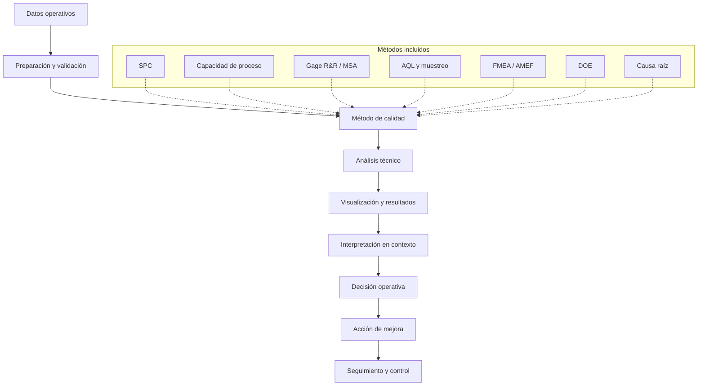
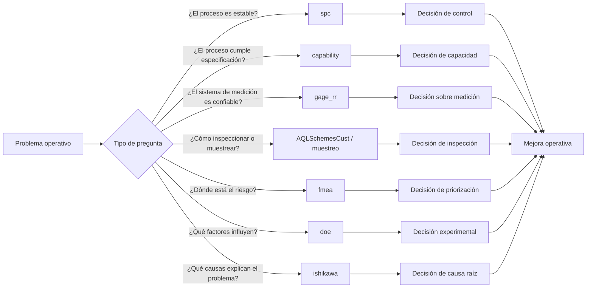
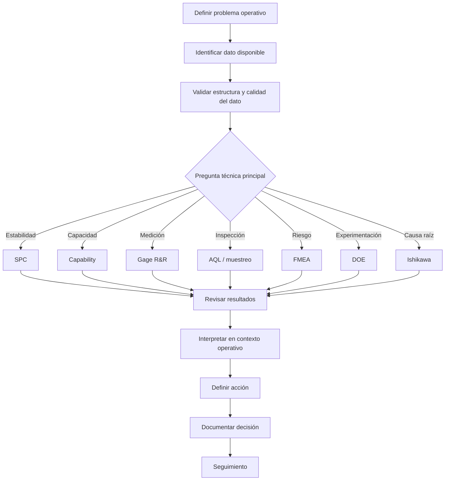
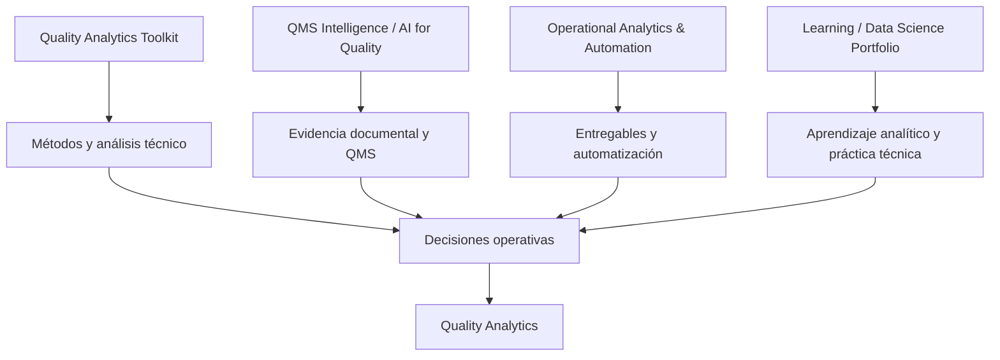

# Quality Analytics Toolkit

Herramientas prácticas para calidad, excelencia operacional y mejora de procesos basada en datos.

Este repositorio funciona como un índice curado de herramientas desarrolladas para apoyar a equipos de calidad y operaciones en la conversión de datos de proceso en análisis más claros, mejores decisiones y rutinas de mejora más consistentes.

El enfoque no está solo en aplicar métodos estadísticos.

El enfoque está en hacer que esos métodos sean más fáciles de usar con datos reales de operación.

## Propósito

En muchos entornos de calidad y operaciones, el problema no es la falta de métodos.

Los equipos ya conocen herramientas como SPC, análisis de capacidad, Gage R&R, AMEF/FMEA, DOE, planes de muestreo y análisis de causa raíz.

El reto real es operativo:

- los datos suelen estar en archivos Excel o CSV;
- el análisis requiere preparación manual;
- las salidas no siempre están estandarizadas;
- los resultados técnicos no siempre se conectan con decisiones;
- se generan reportes, pero no siempre se convierten en mejora del proceso.

Quality Analytics Toolkit está diseñado alrededor de esa brecha.

Su propósito es convertir métodos de calidad en flujos prácticos que ayuden a pasar de datos a análisis, de análisis a interpretación y de interpretación a decisiones operativas.

## Idea central

La mejora de calidad genera más valor cuando método, datos y decisiones están conectados.

Este toolkit se construye alrededor de cuatro principios:

1. Usar datos que los equipos ya tienen.
2. Reducir la fricción entre datos operativos y análisis técnico.
3. Hacer más operables las herramientas estadísticas de calidad.
4. Apoyar mejores decisiones sin reemplazar el juicio profesional.

La tecnología aporta valor cuando fortalece el sistema.

No reemplaza el pensamiento de calidad, el conocimiento del proceso ni la responsabilidad técnica.

## Arquitectura conceptual

El toolkit conecta métodos clásicos de calidad con datos operativos y decisiones prácticas.

La intención es reducir la distancia entre tener datos, aplicar un método y tomar una decisión útil.

## Mapa de repositorios

| Área | Repositorio | Propósito |
|---|---|---|
| Capacidad de proceso | [capability](https://github.com/fjgonzalezmgt/capability) | Aplicación Shiny para análisis de capacidad de proceso usando datos desde CSV o Excel. Calcula Cp, Cpk, Z, histogramas, estudios sixpack, exportación a Excel e interpretación opcional asistida por IA. |
| Control estadístico de procesos | [spc](https://github.com/fjgonzalezmgt/spc) | Aplicación Shiny que funciona como wrapper de `qicharts2` para ejecutar análisis SPC, run charts, cartas de control, Pareto y Bernoulli CUSUM desde datos operativos. |
| Sistemas de medición | [gage_rr](https://github.com/fjgonzalezmgt/gage_rr) | Aplicación Shiny para estudios Gage R&R usando `SixSigma::ss.rr`, con tablas ANOVA, componentes de variación, study variation, gráficos, exportación a Excel e interpretación opcional asistida por IA. |
| Muestreo de aceptación | [AQLSchemesCust](https://github.com/fjgonzalezmgt/AQLSchemesCust) | Paquete R modificado para esquemas de muestreo AQL. Ajustado para permitir ingreso programático de parámetros y reducir interacción manual por terminal. |
| Herramientas de muestreo | [muestreo](https://github.com/fjgonzalezmgt/muestreo) | Herramientas relacionadas con muestreo, inspección y flujos de datos de calidad. |
| Diseño de experimentos | [doe](https://github.com/fjgonzalezmgt/doe) | Herramientas y flujos relacionados con DOE para mejora de procesos y análisis experimental. |
| Análisis de riesgo | [fmea](https://github.com/fjgonzalezmgt/fmea) | Herramientas relacionadas con AMEF/FMEA y priorización de riesgos para calidad y mejora operacional. |
| Causa raíz | [ishikawa](https://github.com/fjgonzalezmgt/ishikawa) | Herramientas relacionadas con análisis Ishikawa / causa-efecto para solución estructurada de problemas. |

## Relación entre herramientas

Cada herramienta atiende una parte distinta del sistema de calidad y mejora.

El objetivo no es usar todas las herramientas en todos los casos.

El objetivo es elegir la herramienta correcta según la pregunta operativa.

## Líneas principales del toolkit

### 1. Control de procesos

Repositorios:

- [spc](https://github.com/fjgonzalezmgt/spc)

Esta línea se enfoca en ayudar a los usuarios a analizar la variación a lo largo del tiempo.

El objetivo es facilitar la aplicación de SPC desde archivos reales, no solo desde ejemplos preparados. El flujo permite seleccionar análisis, validar datos, visualizar resultados y generar salidas exportables.

Casos de uso típicos:

- monitoreo de estabilidad del proceso;
- identificación de señales de causa especial;
- revisión del comportamiento del proceso en el tiempo;
- soporte a rutinas diarias, semanales o mensuales de revisión de calidad.

### 2. Capacidad de proceso

Repositorios:

- [capability](https://github.com/fjgonzalezmgt/capability)

Esta línea se enfoca en traducir datos de proceso en indicadores de capacidad.

El objetivo es ayudar a los equipos a evaluar si un proceso puede cumplir límites de especificación y comunicar el resultado de forma útil para la toma de decisiones.

Casos de uso típicos:

- análisis de Cp y Cpk;
- estudios de capacidad para características medidas;
- revisión de desempeño del proceso;
- línea base de proyectos de mejora;
- comparación antes/después de cambios de proceso.

### 3. Sistemas de medición

Repositorios:

- [gage_rr](https://github.com/fjgonzalezmgt/gage_rr)

Esta línea se enfoca en análisis de sistemas de medición.

Antes de mejorar un proceso, el sistema de medición debe entenderse. Esta herramienta ayuda a ejecutar estudios Gage R&R desde datos prácticos y revisar la variación atribuible a partes, operadores y error de medición.

Casos de uso típicos:

- validación de sistemas de inspección o medición;
- evaluación de variación por operador y por parte;
- preparación de evidencia MSA para sistemas de calidad;
- soporte a decisiones sobre confiabilidad de mediciones.

### 4. Muestreo e inspección

Repositorios:

- [AQLSchemesCust](https://github.com/fjgonzalezmgt/AQLSchemesCust)
- [muestreo](https://github.com/fjgonzalezmgt/muestreo)

Esta línea se enfoca en planes de muestreo y lógica de inspección.

El objetivo es apoyar el uso reproducible de métodos de muestreo, especialmente cuando las decisiones de inspección necesitan integrarse en scripts, reportes o flujos de calidad.

Casos de uso típicos:

- planificación de inspección basada en AQL;
- análisis de muestreo de aceptación;
- recuperación automatizada de planes de muestreo;
- estandarización de flujos de inspección.

### 5. Riesgo y causa raíz

Repositorios:

- [fmea](https://github.com/fjgonzalezmgt/fmea)
- [ishikawa](https://github.com/fjgonzalezmgt/ishikawa)

Esta línea se enfoca en pensamiento estructurado para problemas de calidad y operación.

El objetivo es conectar análisis cualitativo con datos, priorización y soporte a decisiones.

Casos de uso típicos:

- análisis AMEF/FMEA;
- priorización de riesgos;
- exploración de causas raíz;
- talleres de solución de problemas;
- soporte a CAPA;
- documentación de proyectos de mejora.

### 6. Mejora experimental

Repositorios:

- [doe](https://github.com/fjgonzalezmgt/doe)

Esta línea se enfoca en diseño de experimentos y aprendizaje estructurado del proceso.

El objetivo es apoyar una mejor experimentación cuando los equipos necesitan entender qué factores influyen sobre una respuesta de proceso.

Casos de uso típicos:

- optimización de procesos;
- filtrado de factores relevantes;
- análisis de respuestas;
- experimentación en proyectos de mejora;
- aprendizaje a partir de cambios controlados en el proceso.

## Flujo de uso recomendado

Un flujo típico dentro del toolkit puede verse así:

El valor aparece cuando el análisis cambia una decisión, una rutina de control o una acción de mejora.

## Cómo deberían usarse estas herramientas

Estos repositorios no buscan reemplazar al profesional de calidad, al dueño del proceso ni el criterio estadístico.

Buscan reducir fricción.

Un flujo típico sería:

1. Partir de datos operativos.
2. Cargar los datos en una interfaz o script práctico.
3. Validar la estructura del conjunto de datos.
4. Ejecutar el método técnico.
5. Revisar la salida.
6. Exportar los resultados.
7. Interpretar el hallazgo en contexto.
8. Decidir la siguiente acción operativa.

El valor aparece cuando el análisis cambia una decisión.

## Principios comunes de diseño

A través del toolkit, la intención de diseño es consistente:

- leer datos desde formatos comunes como Excel o CSV;
- reducir preparación manual;
- facilitar la ejecución de métodos técnicos;
- exponer salidas estadísticas con claridad;
- generar evidencia exportable;
- apoyar la interpretación sin ocultar supuestos;
- mantener revisión humana y juicio profesional en el proceso.

## Usuarios objetivo

Este toolkit está diseñado para:

- ingenieros de calidad;
- ingenieros de proceso;
- profesionales de mejora continua;
- practicantes Lean Six Sigma;
- líderes de operaciones;
- analistas de supply chain;
- responsables de QMS y CAPA;
- profesionales técnicos que trabajan con datos de proceso.

Es especialmente útil para profesionales que ya tienen datos, indicadores y métodos de calidad, pero necesitan mejores formas de conectarlos con decisiones.

## Qué demuestra este toolkit

Este portafolio de proyectos demuestra la capacidad de conectar:

- ingeniería de calidad;
- excelencia operacional;
- Lean Six Sigma;
- métodos estadísticos de calidad;
- analítica de datos;
- automatización;
- interpretación asistida por IA;
- soporte práctico a decisiones.

El énfasis está en la ejecución aplicada.

El toolkit refleja una visión práctica de Quality Analytics:

> Mejores decisiones de calidad requieren más que datos. Requieren método, contexto, validación y seguimiento operativo.

## Relación con otros hubs

Quality Analytics Toolkit es la línea más directamente conectada con métodos de calidad y mejora operacional.

Se complementa con otros hubs del ecosistema:

La función del toolkit es convertir métodos de calidad en herramientas aplicables.

Los demás hubs complementan esa función con documentación, automatización, aprendizaje y comunicación.

## Orden sugerido de revisión

Si estás revisando este toolkit como portafolio profesional, empieza por:

1. [capability](https://github.com/fjgonzalezmgt/capability)
2. [spc](https://github.com/fjgonzalezmgt/spc)
3. [gage_rr](https://github.com/fjgonzalezmgt/gage_rr)
4. [AQLSchemesCust](https://github.com/fjgonzalezmgt/AQLSchemesCust)
5. [fmea](https://github.com/fjgonzalezmgt/fmea)
6. [doe](https://github.com/fjgonzalezmgt/doe)

Estos repositorios muestran la dirección principal del toolkit: convertir métodos de calidad en flujos operativos.

## Roadmap

Mejoras previstas para el toolkit:

- estandarizar la estructura de README en todos los repositorios;
- agregar capturas de pantalla y ejemplos de flujo;
- incluir datasets de ejemplo cuando aplique;
- documentar supuestos y limitaciones de cada método;
- agregar casos de uso por escenario de calidad;
- mejorar reportes exportables;
- alinear identidad visual entre repositorios;
- conectar herramientas seleccionadas en una suite más amplia de Quality Analytics.

## Sobre el proyecto

Este toolkit es desarrollado por Francisco González como parte de Quality Analytics.

El propósito más amplio es ayudar a profesionales de calidad y operaciones a usar mejor los datos, no solo para reportar desempeño, sino para mejorar decisiones, controlar procesos y sostener mejoras operativas.

Focos principales:

- quality analytics;
- excelencia operacional;
- Lean Six Sigma;
- control de procesos;
- sistemas de medición;
- análisis de capacidad;
- muestreo e inspección;
- análisis de riesgo y causa raíz;
- flujos de calidad asistidos por IA.

## Enlaces relacionados

- [Perfil de GitHub](https://github.com/fjgonzalezmgt)
- [QMS Intelligence / AI for Quality](https://github.com/fjgonzalezmgt/QMS-Intelligence-AI-for-Quality)
- [Operational Analytics & Automation](https://github.com/fjgonzalezmgt/Operational-Analytics-Automation)
- [Learning / Data Science Portfolio](https://github.com/fjgonzalezmgt/Learning-Data-Science-Portfolio)
- [Quality Analytics](https://qualityanalytics.net)
- [LinkedIn](https://www.linkedin.com/in/franciscogonzalez)
